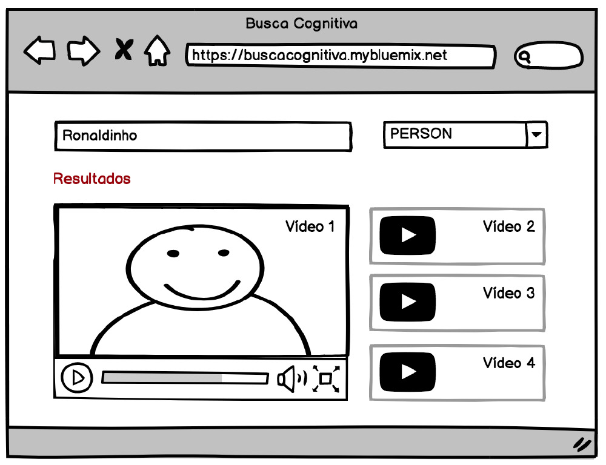
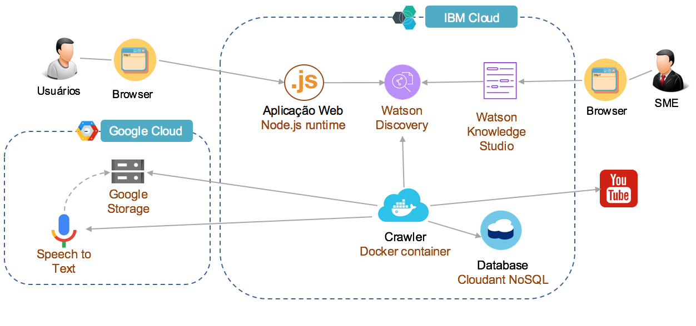
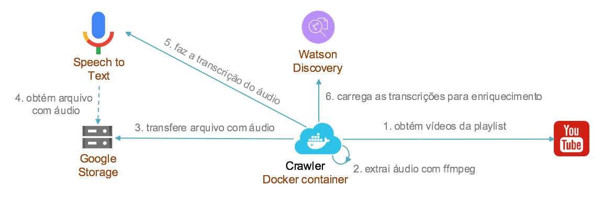

# Cognitive Search

Projeto para pesquisa de vídeos baseado em seus conteúdos de áudio.

## Descrição

Esta aplicação tem como objetivo permitir que o usuário pesquise por vídeos indexados no Watson Discovery através de seus conteúdos de áudio em português. A indexação no Watson Discovery é realizada com base em um modelo customizado desenvolvido para o assunto Esporte, treinado para identificar tipos de entidade relevantes neste domínio, como:

* SPORT: Esporte ao qual está relacionado ao vídeo, exemplos: Vôlei, Futebol e Tênis.
* PERSON: Atletas, árbitros e treinadores, exemplos: Ronaldinho Gaúcho e Felipão.
* ORGANIZATION: Clubes, times e seleções, exemplos: FC Barcelona, Vasco e Flamengo.
* EVENTS: Edição do Campeonato, jogo, prova, exemplos: Olimpíadas Rio 2016 e Campeonato Brasileiro.

Para exemplificar a aplicação foi criada uma playlist no YouTube: [clique para abrir a playlist.](https://www.youtube.com/playlist?list=PLHE4HqjuUaC56aHNt4t4p4A075OSLKjyK)

Para fazer a consulta, o usuário inicialmente seleciona o tipo de entidade e em seguida informa o texto de pesquisa, na sequência a aplicação irá listar um conjunto de vídeos retornados na busca com base no texto e filtro informados pelo usuário, como exemplificado no wireframe abaixo:

<!-- Neste link ([clique para abrir](https://buscacognitiva.mybluemix.net)) você pode acessar uma instância da aplicação que faz a busca nos vídeos da playlist indicada acima. -->

## Arquitetura

A IBM Cloud foi a plataforma selecionada para executar a aplicação de busca cognitiva de vídeos. Além do Watson Discovery são utilizados o serviço de Speech to Text e o Knowledge Studio. A figura a seguir ilustra uma visão geral da arquitetura da solução:

### Serviços IBM Cloud

*	Watson Discovery Service: responsável por indexar o conteúdo e implementar a busca inteligente.
*	Watson Knowledge Studio: utilizado pelo especialista para treinar um modelo customizado.
* Cloudant NoSQL: database utilizado para controle do processo de transcrição

### Serviços Google Cloud

*	Speech to Text: componente responsável pela transcrição dos áudios.

### Principais Componentes da Aplicação

*	Aplicação Web: componente implementado em React e Node.JS responsável por prover a interface gráfica com o usuário e realizar a consulta no serviço Watson Discovery.  
*	Crawler: para que o Discovery possa fazer a indexação do conteúdo é necessário que seja feito o ingest dos documentos com as transcrições no serviço, portanto será implementado um Crawler responsável por buscar os links dos vídeos, fazer a extração dos áudios, transcrição e carga no Discovery, como ilustrado abaixo.

